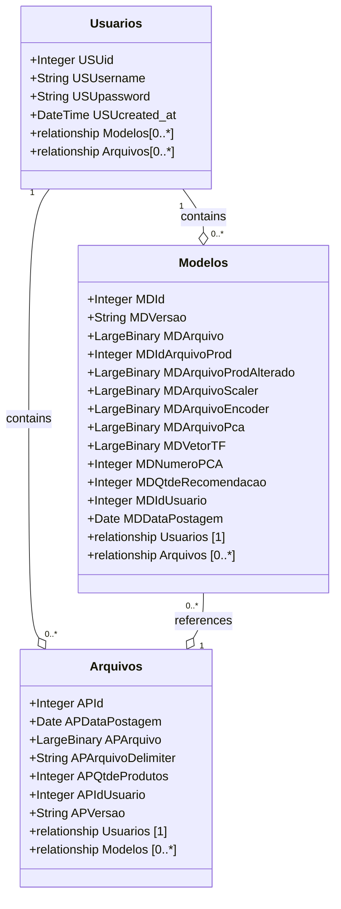

## Índices
* [Objetivo](#Objetivo)
* [Requisitos do Projeto](#Requisitos-do-Projeto)
  *  [Requisitos Funcionais](#Requisitos-Funcionais)
  *  [Requisitos Não Funcionais](#Requisitos-Não-Funcionais)

* [Tecnologias Utilizadas](#Tecnologias-Utilizadas)
  * [Banco de dados](#Iniciar-Banco-de-dados)
  * [Back-End](#Back-End)
  * [CI/CD](#CICD)
  * [Testes de Qualidade](#Testes-de-qualidade)
* [Como iniciar o projeto](#Como-iniciar)
  * [Repositório](#Repositório)
* [Alertas e recomendações](#Alertas-e-Recomendações)
* [Resultados](#Resultados)

# Objetivo
Este projeto tem como foco criar um algoritmo de recomendação de produtos com base na similaridade entre os produtos, utilizando variáveis como peso da embalagem, quantidade que contém em cada pacote, descrição do produto, unidade de venda, código da marca, código da seção e código do departamento. O intuito principal é descobrir quais produtos que contém em uma base de dados é mais semelhante ao produto base escolhido pelo usuário. Será utilizado KNN como algoritmo para aprendizagem e recomendação.

# Escopo
1. Manipulação de arquivos CSV
   * Upload de arquivo CSV.
   * Remoção de arquivo.
2. Tratamento de dados
   * Editar valor de campo desejado.
   * Remover valor desejado.
   * Substituir valor desejado.
   * Deletar registro de tratamento de dados de um arquivo CSV específico.
3. Treinamento
   * Buscar todos os tratamentos de dados para aplicar ao dataset alvo, gerando o modelo treinado.
4. Recomendação
   * Recomendar todos os produtos que são relacionados com outro produto que contém na base.
   * Recomendar produto em específico com base no código do produto

# Requisitos do Projeto
## Requisitos Funcionais
### 1. Manipulação de Arquivos CSV
* O sistema deve permitir o upload de arquivos no formato CSV.
* O sistema deve possibilitar a remoção de arquivos CSV.

### 2. Tratamento de Dados
* O sistema deve permitir que o usuário edite valores específicos em campos de um arquivo CSV.
* O sistema deve possibilitar a remoção de valores específicos em campos de um arquivo CSV.
* O sistema deve permitir a substituição de valores específicos em campos de um arquivo CSV.
* O sistema deve possibilitar a exclusão de registros de um arquivo CSV.

### 3. Treinamento
* O sistema deve buscar e aplicar todos os devidos tratamentos de dados na base de dados escolhida pelo usuário.
* O sistema deve realizar o treinamento de um modelo de recomendação de produtos usando a base de dados escolhida pelo usuário.

### 4. Recomendação
* O sistema deve recomendar produtos relacionados a um produto específico disponível na base de dados. 
* O sistema deve fornecer recomendações de produtos específicos com base no código do produto escolhido pelo usuário.

## Requisitos Não Funcionais
### 1. Usabilidade
* RNF1 - Interface Intuitiva (API): A API deve ter endpoints bem documentados (por exemplo, utilizando Swagger ou API Blueprint), para facilitar a compreensão e utilização por desenvolvedores.
* RNF2 - Documentação Completa: A API deve ser acompanhada por uma documentação clara e detalhada, explicando todos os endpoints, parâmetros, exemplos de uso e códigos de resposta.
### 2. Confiabilidade
* RNF3 - Tolerância a Falhas: O sistema deve ser resiliente, garantindo que falhas em um módulo não comprometam o funcionamento de outros módulos. Ele deve ser capaz de retomar o processamento após falhas e salvar o estado das operações críticas.
* RNF4 - Backup e Recuperação: O sistema deve realizar backups periódicos dos dados (datasets, modelos treinados e logs), com mecanismos de recuperação em caso de falhas ou perda de dados.
* RNF5 - Consistência dos Dados: Em caso de falhas durante operações críticas, como a aplicação de regras de tratamento ou treinamento de modelos, o sistema deve garantir que os dados permanecem consistentes, evitando estados intermediários corrompidos.

# Diagramas
## Diagrama de classe

# Tecnologias Utilizadas

### Back-End
  * Python
    * Poetry
      * Flask
      * Scikit-Learn
      * Pandas
      * Numpy
      * Flasgger
      * NumPy
      * Re
      * Pandas
      * Pyodbc
      * Pyjwt
      * SqlAlchemy 
  

### CI/CD
* GitHub Actions
* Docker

### Testes de qualidade
* PyUnit: É uma biblioteca para realização de testes unitários em Python baseada na arquitetura xUnit. É a forma mais difundida para realizar a prática de testes unitários pela comunidade Python.
   * Foram realizados diversos testes com foco em ter a porcentagem de cobertura de testes em 100%, desde em endpoints de usuário até testes em cada entidade afim de testar o fluxo de todo o CRUD.
* Testes no algoritmo de recomendação:
   * Foram realizados alguns testes, sendo eles:
     * Acerto em peso unitário aproximado(utilizando uma margem de 10% de diferença, ainda é considerado certo) ao produto base = 87,07%
     * Acerto em seção e departamento igual ao produto base = 100%
     * Acerto em quantidade que contém na embalagem comparado ao produto base = 100%

## Resultados
* Com base em vários testes, obtive uma boa recomendação utilizando a base disponibilizada na pasta `arquivosNecessarios/BaseDados` com os seguintes parametros:
  * Núm. PCA: 800
  * Quantidade de recomendações: 2
  * Distância aceitável para inclusão: 1.00 
* Conclusão: Com base na porcentagem de acertos em cada tipo de teste realizado, o que impacta diretamente nas recomendações é o número de componentes que é colocado. O que foi verificado é que variações de 400 a 800 são as que mais trazem recomendações interessantes e mantém  a porcentagem de acertos alta.

# Como iniciar
### Iniciar Banco de dados
> [!WARNING]
> Este projeto utiliza SQL Server.
  1. Baixe o SQL Server neste link: https://www.microsoft.com/pt-br/sql-server/sql-server-downloads
  2. Inicie sua instância do SQL Server.
  3. Se optar por baixar o repositório, abra o arquivo config.ini e altere os valores necessários para conexão com banco de dados.
     * As variáveis que devem ser preenchidas são:
       * DRIVER | Exemplo = ODBC Driver 17 for SQL Server
       * SERVER | Exemplo = localhost
       * DATABASE | Exemplo = RecomendacaoProdutos

## Repositório
Para clonar o repositório, você precisa ter o Git Bash, GitHub Desktop ou se preferir pode clonar o projeto via CURL/WGET.
1. Faça o clone do repositório
    * Git Bash: git clone https://github.com/AmarildoZoletJunior/ProjetoTCCPrivado.git
    * Curl: curl -L https://github.com/AmarildoZoletJunior/ProjetoTCCPrivado/archive/refs/heads/master.zip --output ProjetoTCCPrivado.zip
2. Para instalar todas as dependências do poetry, inicie um cmd apontado para a pasta principal do projeto.
    * Digite `pip install poetry`
    * Após o download, verifique se foi feito o download 100% sem erros.
    * Digite `poetry install` e verifique se foi instalado 100% sem erros.
    * Digite `poetry shell` dentro da pasta em que está localizado o arquivo poetry.lock
    * Após ele entrar no shell do poetry, digite `flask run --debug`

3. Para executar requisições em endpoints protegidos pelo JWT
    * no Endpoint `http://<ip>:<porta>/login`, utilize as seguintes credenciais:
      * Usuário: admin
      * Senha: admin
    * Após isto, em todo Endpoint que está protegido, faça autenticação utilizando a header `Authorization` e o valor inicial `Bearer SEU-TOKEN`
 
OU
 
## Imagem Docker
Você pode optar por rodar a aplicação em uma imagem docker, para isto é necessário ter instalado o docker em seu computador.
1. Com o docker instalado, abra o CMD e digite `docker push amarildojunior/tccprivado`
2. Após isto, digite `docker run -e DB_DRIVER="ODBC Driver 17 for SQL Server" -e DB_SERVER="host.docker.internal" -e DB_DATABASE="RecomendacaoProdutos" -e DB_USER="teste" -e DB_PASSWORD="teste" -e IP="localhost" -e PORTA="5000" -e STRING_CODIFICACAO_JWT="Teste" nome-da-imagem`
   * `-e` comando utilizado para inserir valor a uma variável de ambiente
     * DB_DRIVER="ODBC Driver 17 for SQL Server"
       * O que é: O driver do banco de dados SQL Server.
       * Exemplo: "ODBC Driver 17 for SQL Server" é o driver usado para conectar ao SQL Server.
     * DB_SERVER="host.docker.internal"
       * O que é: O endereço do servidor SQL (onde o banco de dados está).
       * Exemplo: "host.docker.internal" significa que o SQL Server está rodando na mesma máquina que o contêiner.
     * DB_DATABASE="RecomendacaoProdutos"
       * O que é: O nome do banco de dados a ser acessado.
       * Exemplo: "RecomendacaoProdutos" é o nome do banco de dados onde os dados ficam armazenados.
     * DB_USER="teste"
       * O que é: O nome de usuário para autenticação no banco de dados.
       * Exemplo: "teste" é o nome de usuário que o aplicativo usará para se conectar ao SQL Server.
     * DB_PASSWORD="teste"
       * O que é: A senha do usuário para acessar o banco de dados.
       * Exemplo: "teste" é a senha usada junto com o nome de usuário para autenticar.
     * IP="localhost"
       * O que é: O IP onde o aplicativo vai escutar.
       * Exemplo: "localhost" significa que o aplicativo vai aceitar conexões de qualquer IP.
     * PORTA="5000"
       * O que é: A porta em que o aplicativo vai rodar.
       * Exemplo: "5000" é a porta onde o serviço será acessado.
     * STRING_CODIFICACAO_JWT="Teste"
       * O que é: A chave secreta para criar e verificar tokens JWT (usados em login/segurança).
       * Exemplo: "Teste" é uma string simples para gerar tokens JWT (em produção, use uma chave mais segura).
3. Verifique se subiu corretamente o container e se iniciou a API.

# Alertas e Recomendações 
> [!WARNING]
> As recomendações dependem 100% da qualidade dos dados, então esteja ciente que você deve ter um dataset que tenha pelo menos duas features, e que exista alguma similaridade entre os dados de cada feature.

> [!CAUTION]
> * Para realizar novos treinamentos, somente é aceito arquivos CSV. Caso não seja importado arquivo no formato CSV, não será gerado um novo modelo treinado.
> * Para usar o algoritmo afins de realizar testes, está disponível uma base de dados em `arquivosNecessarios/BaseDados/DataSetProdutos.csv`

# Contribuições
> [!NOTE]
> Para contribuir com este projeto, abra um pull request para que possamos analisar suas edições e aprovar/rejeitar.

# Informações
> [!NOTE]
> Está disponível um json com todas as recomendações feitas, em `arquivosNecessarios/Resultados/JsonRecomendacoes.txt`

